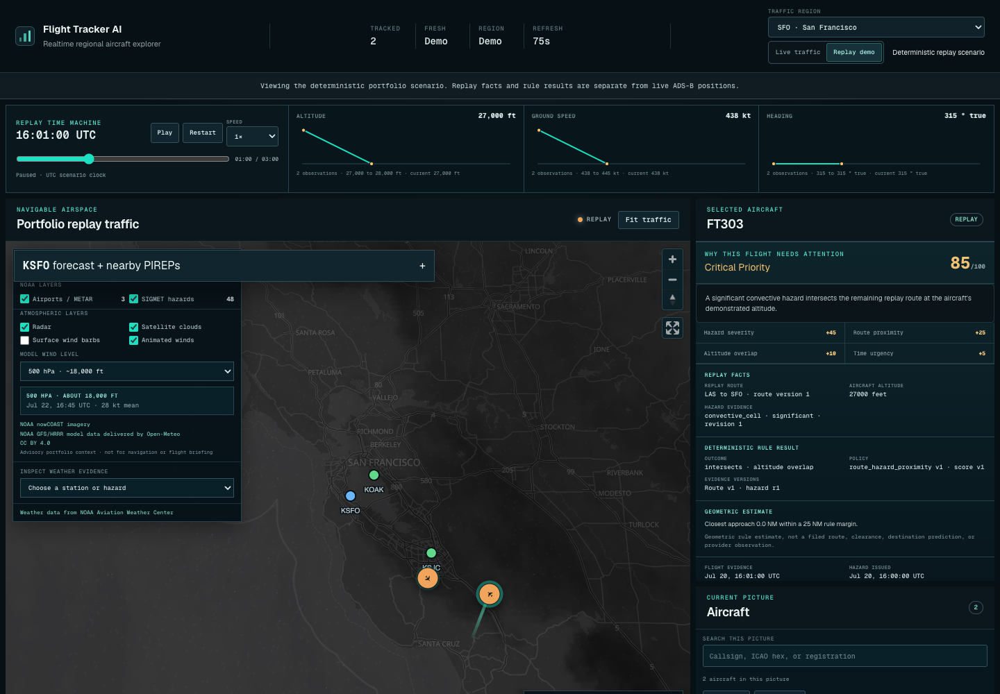
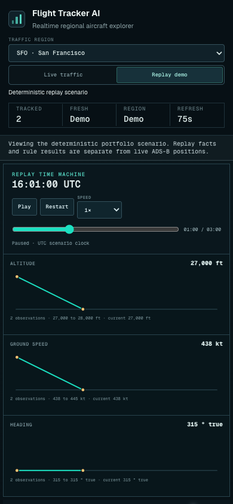

# Flight Tracker AI

An interactive aviation-intelligence portfolio project for exploring regional
aircraft, weather, trajectories, and explainable attention signals on one
navigable map.

[Explore the live tracker](https://flight-tracker-ai-one.vercel.app) ·
[Read the engineering plan](plans/README.md)



## What you can explore

- **Regional live traffic** — switch among seven bounded airport regions: SFO,
  LAX, SEA, DEN, ORD, ATL, and JFK. Best-effort ADS-B positions animate between
  updates and fall back to a clearly labeled deterministic replay when the
  provider is unavailable.
- **Trajectories and motion** — select an aircraft to see a short, in-memory
  observed trail and a separately styled five-minute geometric projection.
- **Aviation weather** — combine NOAA METAR stations and SIGMET hazards with
  radar, satellite clouds, surface wind barbs, and animated model winds from
  the surface through 300 hPa.
- **Explainable attention** — the replay scenario shows why a flight needs
  attention, including the deterministic rule result, source facts, score
  components, and geometric estimate.
- **Time machine and telemetry** — play, pause, restart, scrub, and change the
  speed of a repeatable scenario while altitude, ground speed, and heading
  charts update with scenario time.
- **Search and shareable state** — find aircraft by callsign, registration, or
  ICAO identifier and copy a URL that preserves the selected region, aircraft,
  map position, replay time, and weather layers.
- **Airport intelligence** — inspect bounded TAF forecast periods and nearby
  PIREPs for the selected region with source time and freshness visible.

The public experience is read-only and does not require an account.

### Responsive by design

<p align="center">
  
</p>

## Product boundaries

This is a non-commercial portfolio demonstration for recruiters and hiring
managers, not a certified aviation product. It is not for flight planning,
dispatch release, aircraft control, or operational decision-making.

The product deliberately distinguishes its evidence:

| Capability               | Source and behavior                                                                                                 |
| ------------------------ | ------------------------------------------------------------------------------------------------------------------- |
| Aircraft positions       | Optional, ephemeral ADSB.lol observations with visible ODbL attribution; never persisted or sent to an LLM          |
| Replay                   | Project-authored, deterministic scenario that remains available when live positions fail                            |
| Aviation weather         | NOAA Aviation Weather Center observations, forecasts, pilot reports, and hazards                                    |
| Atmospheric context      | NOAA nowCOAST imagery plus a bounded Open-Meteo GFS/HRRR wind grid                                                  |
| Attention and projection | Deterministic rules and geometry with explicit assumptions and labels                                               |
| AI drafting              | An internal, human-reviewed Rust experiment with deterministic fallback; not exposed as an automatic public feature |

Deterministic code owns eligibility and severity. OpenAI may support constrained
drafting research, but model output cannot select routes, approve itself, send
messages, or trigger operational actions.

## Architecture

```text
Browser
  └─ Next.js / TypeScript interface and server-side public boundary (Vercel)
       └─ Rust / Axum modular monolith (Render)
            ├─ ingestion and source normalization
            ├─ replay, geometry, attention policy, and drafting boundaries
            └─ PostgreSQL / PostGIS system of record (Neon)
```

Provider payloads, domain facts, API contracts, and UI models stay separate.
The Rust backend owns operational policy; Next.js owns the interactive public
experience. Public endpoints are sanitized and `no-store`, while protected
tenant workflows remain behind server-side authorization.

## Run locally

Requirements:

- Docker Desktop
- Make
- Node.js 24.18.0 and npm 11.16.0 for the full local verification suite

```sh
cp .env.example .env
nvm use
make dev
```

Open the web interface at [http://localhost:3001](http://localhost:3001). The
Rust health and readiness endpoints are available at
[http://localhost:8080/health](http://localhost:8080/health) and
[http://localhost:8080/readiness](http://localhost:8080/readiness).

The default local stack uses deterministic replay. Live NOAA and ADSB.lol
ingestion are opt-in and have bounded polling, attribution, freshness, and
failure behavior documented in [NOAA ingestion](plans/NOAA_INGESTION.md) and
[the ADSB.lol integration decision](plans/ADSBLOL_INTEGRATION.md).

```sh
make verify  # Rust format, Clippy, tests; web lint, types, tests, build; Compose validation
make down
```

## Repository map

```text
apps/api/       Rust/Axum API, ingestion, replay, policy, and workflows
apps/web/       Next.js/React tracker and server-side public boundary
fixtures/       Versioned deterministic replay and evaluation scenarios
migrations/     PostgreSQL/PostGIS migrations
plans/          Product decisions, risks, milestones, and ticket evidence
evidence/       Versioned production and evaluation audit artifacts
```

Read [plans/README.md](plans/README.md) before implementation. Each ticket uses
a dedicated branch, ticket-scoped commits, and one pull request.

## Deployment

The public interface and its server-side routes run on Vercel. The long-running
Rust service runs separately on Render, and Neon hosts PostgreSQL/PostGIS. See
[the deployment runbook](plans/HOSTED_DEPLOYMENT_RUNBOOK.md) for environment contracts,
health checks, promotion, and rollback procedures.

## Data attribution

- Aircraft data: [ADSB.lol](https://adsb.lol/) under ODbL 1.0 when the live
  layer is available
- Aviation weather: [NOAA Aviation Weather Center](https://aviationweather.gov/)
- Atmospheric imagery: [NOAA nowCOAST](https://nowcoast.noaa.gov/)
- Model wind delivery: [Open-Meteo](https://open-meteo.com/) using NOAA
  GFS/HRRR model data under CC BY 4.0
- Map: OpenFreeMap, OpenMapTiles, and OpenStreetMap contributors

Source authority, timestamps, freshness, and degraded states remain visible in
the product. Always verify the authoritative source before acting.
